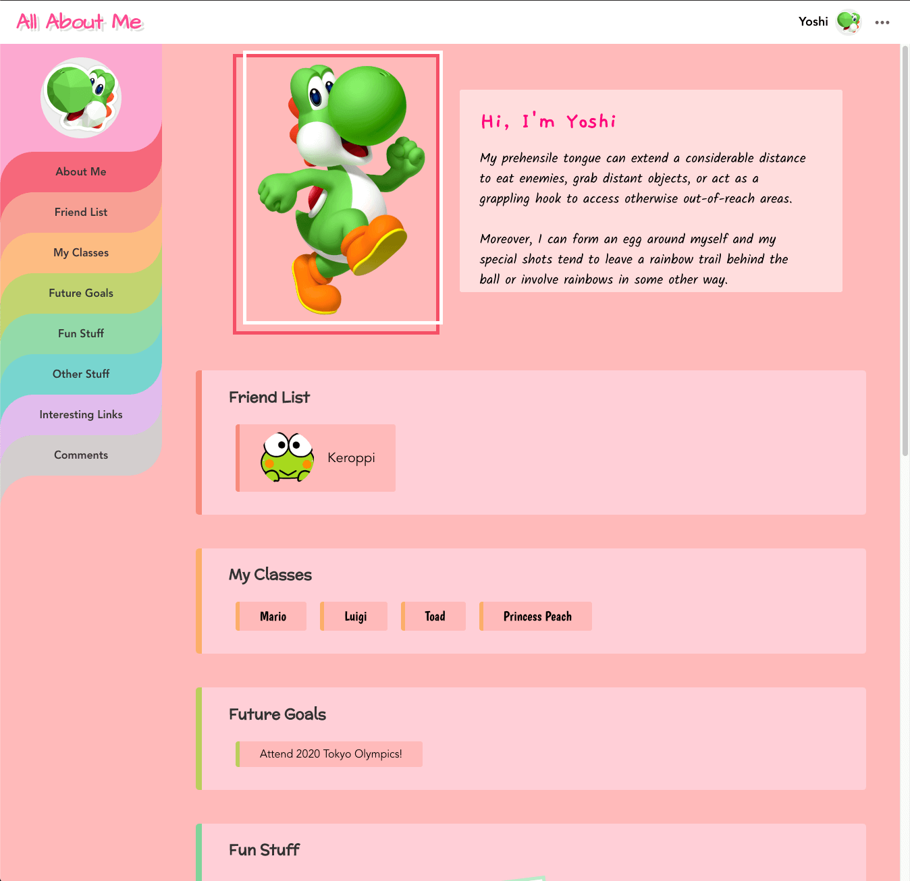

# All-About-Me

A Social Media Web App built with Vue.js, Firebase, Element-UI, Disqus, Vuex, Vue-Router, and Sass.

## Online Demo

https://bb-all-about-me.netlify.app/



## Project setup

```
npm install
```

### Compiles and hot-reloads for development

```
npm run serve
```

### Compiles and minifies for production

```
npm run build
```

### Lints and fixes files

```
npm run lint
```

### Customize configuration

See [Configuration Reference](https://cli.vuejs.org/config/).
